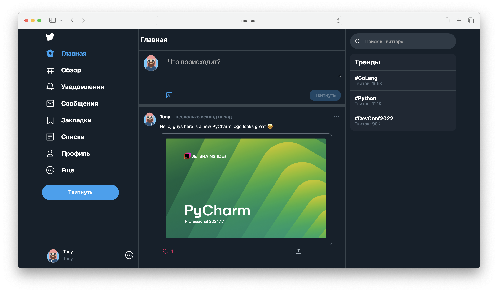

# Twitter Clone

Клон Twitter с возможностью добавлять твиты, ставить реакции и фолловить пользователей



## Как установить

1. Клонируйте репозиторий командой

   ```shell
   git clone https://github.com/sanscolte/twitter.git
   ```

2. Установите Docker и Docker Compose
- https://docs.docker.com/engine/install/
- https://docs.docker.com/compose/install/

## Как запустить

Для запуска перейдите в корень проекта и запустите

```shell
make
```
